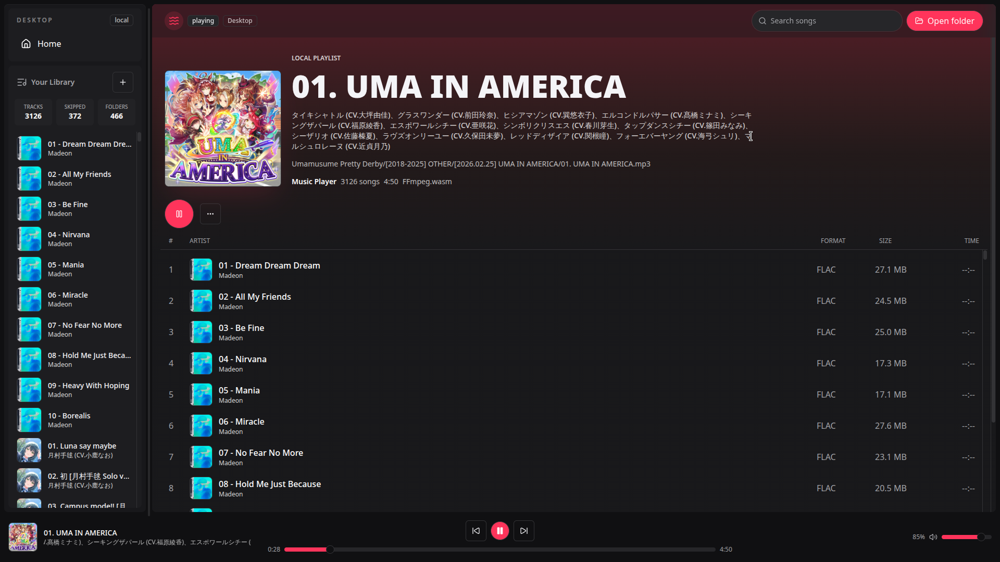
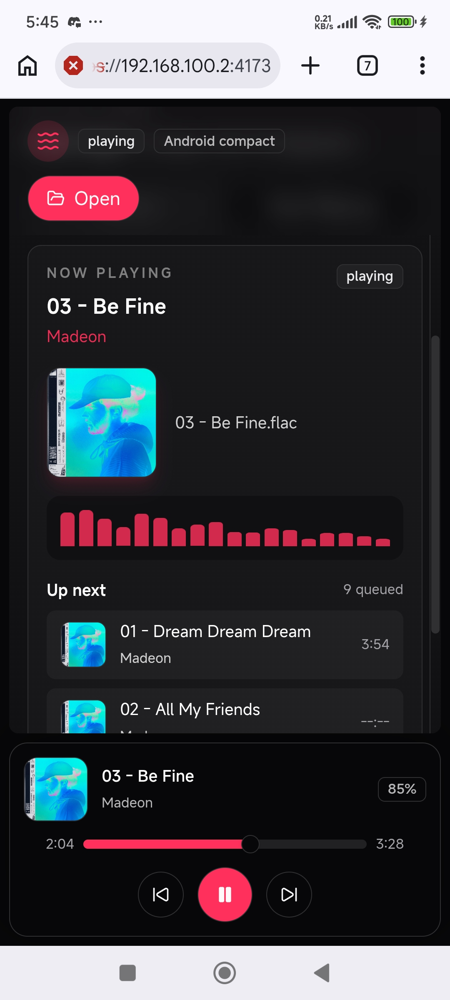

# Music Player

A bleeding-edge, Chromium-first local music player that runs entirely in the
browser. It uses React 19, Vite, Tailwind CSS, shadcn-style UI primitives,
File System Access, FFmpeg.wasm, Web Workers, and an AudioWorklet playback
engine.

Pick a local music folder, scan thousands of tracks in-browser, extract artwork
and artist metadata, then play decoded PCM through Web Audio without uploading
your files anywhere.

## Showcase

| Desktop library                                                          | Android compact player                                                                                         |
| ------------------------------------------------------------------------ | -------------------------------------------------------------------------------------------------------------- |
|  |  |

## Live Preview

- [https://react-music-player-wasm.vercel.app/](https://react-music-player-wasm.vercel.app/) Make sure you use supported browser [MDN File System API](https://developer.mozilla.org/en-US/docs/Web/API/File_System_API#browser_compatibility)

## Highlights

- Local-only folder access through `showDirectoryPicker()`.
- Recursive scanning for MP3, WAV, FLAC, OGG, Opus, M4A, and AAC.
- Apple Music-inspired responsive UI for desktop, tablet, and mobile.
- Searchable TanStack Virtual track lists for large libraries.
- Artist metadata and cover extraction in dedicated metadata workers.
- Selected-track decode with FFmpeg.wasm into stereo 48 kHz float PCM.
- AudioWorklet playback with seeking, volume, levels, progress, and queue advance.
- LRU-bounded request and artwork caches for long virtual-scroll sessions.
- Native worker runtime with typed routing, `AbortController` sessions, throttled
  scan progress, and Explicit Resource Management for temp-file cleanup.

## Requirements

- Bun 1.3 or newer, or a recent Node runtime.
- A Chromium-based browser. The app is intentionally Chromium-first because
  File System Access folder picking is not evenly supported across engines.
- HTTPS local development. The Vite config reads `localhost.pem` and
  `localhost-key.pem` from the project root.
- Cross-origin isolation for the full WASM/audio runtime:

```text
Cross-Origin-Opener-Policy: same-origin
Cross-Origin-Embedder-Policy: require-corp
Cross-Origin-Resource-Policy: same-origin
```

## Getting Started

```sh
bun install
bun run dev
```

Open one of these:

- `https://localhost:5173/`
- `https://127.0.0.1:5173/`

If Chrome does not trust the certificate, generate local certificates with
`mkcert` and replace `localhost.pem` plus `localhost-key.pem`.

## Scripts

```sh
bun run dev       # Start Vite with HTTPS and host binding.
bun run build     # Type-check with tsc, then build production assets.
bun run lint      # Run ESLint.
bun run preview   # Preview the production build.
bun run doctor    # Run the React diagnostics helper.
```

## Architecture

```text
src/
├── components/features/music/       Player panels, tables, covers, search, transport.
├── context/AppContext/              Runtime command context for nested UI.
├── hooks/music-runtime/             Focused hooks for browser, worker, and audio runtime.
├── stores/music-app/                Zustand state, actions, and selectors.
├── workers/
│   ├── metadata/                    Directory scan, artist tags, cover extraction.
│   ├── decoder/                     Selected-track FFmpeg decode and PCM shaping.
│   └── shared/                      Worker runtime, concurrency, FFmpeg, path helpers.
├── worklets/player-worklet.ts       Real-time Web Audio PCM renderer.
├── lib/                             Capability, formatting, filtering, cache helpers.
└── types/audio.ts                   Track, player, worker, and worklet contracts.
```

### Runtime Flow

```text
Folder picker
  -> metadata/metadata.worker.ts
  -> scan chunks, artist metadata, cover art
  -> useLibraryWorker()
  -> Zustand store
  -> virtualized UI
```

```text
Track selection
  -> decoder/audio-decode.worker.ts
  -> stereo 48 kHz Float32 PCM
  -> AudioWorklet
  -> position, levels, ended events
  -> playback controls and queue advance
```

### Worker Runtime

The worker layer is split by responsibility:

- `metadata/directory-scanner.ts` traverses File System Access handles and emits
  track chunks.
- `metadata/artist-extractor.ts` reads tags with `music-metadata`.
- `metadata/cover-extractor.ts` loads sidecar covers or extracts embedded art
  with FFmpeg.wasm.
- `decoder/audio-decode.worker.ts` decodes the selected track to PCM.
- `shared/worker-runtime.ts` provides typed message routing, cancellable worker
  sessions, and throttled progress.
- `shared/concurrency.utils.ts` owns explicit pools and serial queues.
- `shared/ffmpeg.manager.ts` owns FFmpeg core loading and temp-file disposal.

The current worker runtime avoids framework reactivity on purpose. It uses
native `AbortController` sessions for stale work, `ProgressReporter` for
time-based scan updates, and `await using` for FFmpeg temp-file cleanup.

## Local Data Model

The app does not upload music files. Browser-granted file handles live in memory
for the current session only. Reloading the app or opening a new tab means
selecting the folder again.

Each track stores:

- Stable ID from relative path, size, and modified time.
- Name, artist state, relative path, format, size, and file handle.
- Optional duration, sample rate, channel count, and object URL cover art.

## Gotchas

### Large Libraries Can Still Hurt

Virtualized lists reduce DOM pressure, but a huge folder still requires browser
directory traversal, in-memory track state, metadata work, search/filter passes,
and occasional large FFmpeg jobs. Multi-GB libraries can still cause brief UI or
playback stalls.

### Playback Is Full-Track PCM Today

The selected track is decoded to stereo 48 kHz `Float32Array` PCM before
playback:

```text
48,000 samples/sec * 2 channels * 4 bytes = about 384 KB/sec
about 23 MB/minute of decoded PCM
```

This is simple and reliable, but memory-heavy. A future streaming/ring-buffer
pipeline would be better for very long files.

### FFmpeg.wasm Is Heavy

`ffmpeg.exec()` is CPU-heavy and not finely cancellable. The app ignores stale
results after track switches or rescans, but an already-running FFmpeg command
may continue burning CPU until it returns.

### Browser Support Is Narrow

The app expects Chromium, HTTPS, File System Access, AudioWorklet, WASM, and
cross-origin isolation. Firefox and Safari may fail at folder picking or
multithreaded WASM even when basic Web Audio works.

### Cross-Origin Isolation Is Fragile

Production hosting must preserve the COOP/COEP/CORP headers. A proxy, CDN,
service worker, external script, or incompatible asset can make
`window.crossOriginIsolated` false and disable multithreaded FFmpeg.wasm.

## Quality Checks

Run these before shipping changes:

```sh
bun run lint
bun run build
```
